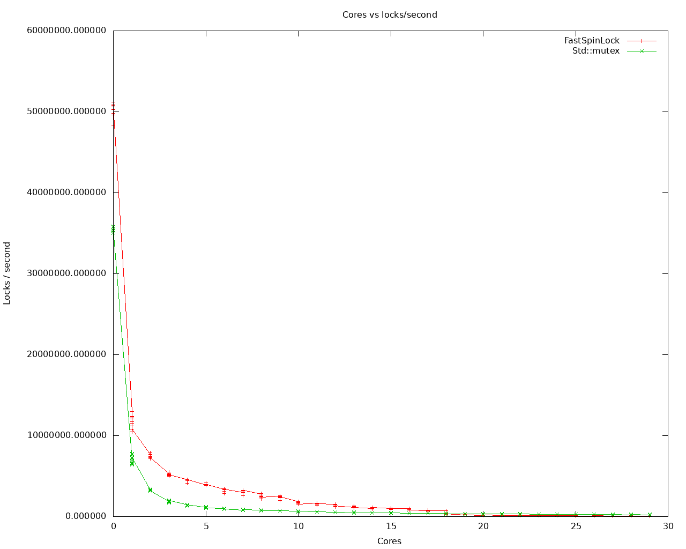
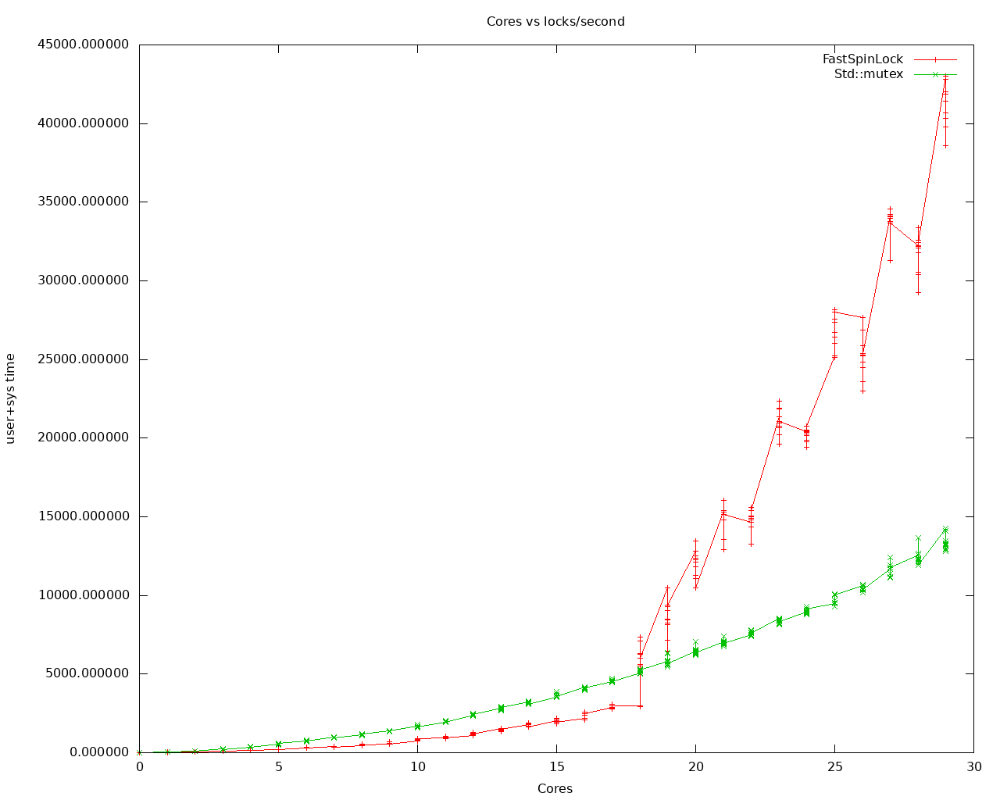

# FastSpinLock

FastSpinLock is a minimal, header‑only C++ spinlock implemented using a single
`std::atomic<bool>` and a test‑and‑set acquire loop. It is designed for cases
where extremely low uncontended latency is required and where the user
understands the tradeoffs of a pure TAS spinlock under contention.

FastSpinLock has:

- zero dependencies
- zero kernel involvement
- no futex fallback
- no fairness guarantees
- a fast uncontended path
- predictable behavior for micro‑critical sections
- a BSD 2-clause license

This project includes:

- the header‑only lock implementation (`FastSpinLock.hpp`)
- a benchmark directory (`benchmark`), which contains a benchmark program that uses wrapped std::mutex and this class and scaled
  between 0 and 29 worker threads (1-30 total threads including main).  Gnuplot scripts (and png files) associated with a run on a
  CentOS 7 40-core 3.1 GHZ single-socket CPU and their input CSV files and output PNG files are attached in the repo.
- Unit test directory (`tests`) is also provided with unit tests that will do std::unique_lock, std::lock_guard, and
  std::condition_variable_any are also provided.

---

## Design Rationale

Std::mutex is implemented (on Linux) on top of futex().  It's good, it's stable, it's not particularly performant.  I've ended
up writing high performance replacements at three different companies, from scratch (because they were done on company resources
and time).  For lower thread-count, a much more efficient solution exists, since we don't have to worry about "contention forever"
cases.  This is an open source equivalent that takes into consideration my multi-core, NUMA aware work, up to 4096 cores over
decades of programming.

The idea is, that well designed code should have mutexes around small numbers of threads, with them being held for limited
amounts of time.  This implementation is optimized for that case.  Std::mutex is implemented for the generic "do no harm" case.

## Compatibility

This class is a direct drop in for std::mutex, with one exception - std::condition_variable is not compatible.  If you want to
use this, use std::condition_variable_any instead.

## Where it should be used instead of std::mutex

This class is designed to have the least overhead possible with the basic rule that locks should be held for very short periods
of time, and a thread should never get descheduled in a lock state (such as doing a message to the systemd-journald logs, or to
disk files).

This is designed for typical use cases where there are a relatively small number of threads that share a mutex.  For example, an
MPMC queue with 16 or fewer threads that can own the lock get better performance than std::mutex, at significantly lower CPU
time (user+system).  At 18-threads, that flips.

If more threads exist than cores, std::mutex will probably be the way to go, because this doesn't deschedule to prevent
CPU thrashing.

It also doesn't protect against lock(A) ; lock(B) in one thread, and lock(B) and lock(A) in another.  I don't believe std::mutex
protects against this case either.

### Performance summary

| Threads | FastSpinLock | std::mutex |
| ------- | ------------ | ---------- |
| 1-9     | Faster       | Slower     |
| 10-17   | Comparable   | Comparable |
| 18+     | Slower       | Faster     |

## Header‑Only Lock

```cpp
class FastSpinLock {
public:
    FastSpinLock() {
        m_lock = false;
    }
    void lock() {
        while (std::atomic_exchange_explicit(&m_lock, true,
                                             std::memory_order_acquire))
            ;
    }
    void unlock() {
        std::atomic_store_explicit(&m_lock, false,
                                   std::memory_order_release);
    }
private:
    std::atomic<bool> m_lock;
};
```

## When to Use

FastSpinLock is appropriate when:

- the critical section is only a few instructions;
- the contention is expected to be low;
- the lock is used in tight loops when `std::mutex` overhead dominates;
- you want predictable, minimal overhead in the uncontended case.

## When Not to Use

FastSpinLock should not be used when:

- contention is high;
- fairness is required;
- threads may block for long periods;
- the critical section performs I/O or system calls;
- you need priority inheritance or wakeup ordering guarantees

Under contention, a TAS spinlock will generate cacheline ping-pong and degrade rapidly (which you will see for the larger core
counts in the graphs).  This is expected and inherent to the design.

## Notes, from experience

If you have lots of threads and each locks the same mutex, you should consider fixing your design.

### Example 1

If you use std::lock_guard and do logs or system calls within the lock state, you should consider your code, and narrow the
scope of the locks (with a more limited open/close bracing protection of the lock).

```cpp
{
    std::lock_guard(std::mutex) lock;
    // access protected data
    // then write data to disk
}
```

Is better represented by

```cpp
{
    std::vector<uint8_t> copy;
    {
        std::lock_guard(std::mutex) lock;
        // access protected data
        // copy protected data to "copy"
    }
    // then write data to disk
}
```

This is an example of how to reduce lock state with std::mutex.  FastSpinLock would get the same benefit.

### Example 2

I once worked at a company that did geolocation of cellular data at the eNodeB (LTE) layer - each eNodeB had one thread, so in
typical use cases, a server supported about 800 eNodeB's, so we had 800 threads with data.  Each thread pushed to a single queue
the data it read from cell phones.  The queue had a mutex.  On a 32-core server, you had about a 1/32 chance of getting a lock
(about 3%) to push to the queue.  It worked OK, but was slow.  When we deployed on a 96 core server, you had a 1/96 chance of
getting the lock (about 1%).  Performance was less than acceptible.  Crappy design.  The queue simply aggregated data from the
sources.

We were actually able to get this to be lock-free - we used TLS.  Each thread appended to a buffer, when the buffer filled,
we output to a socket (which was what the old queue did on the receiving side - one buffer, not one buffer per eNodeB).  This
change gave screaming good performance.

So the key here, if you can get rid of a mutex via smart programming, do that before switching to FastSpinLock (note,
FastSpinLock wouldn't haven't worked here (we tried something similar) because of the huge number of threads doing locks).

## Benchmark results

This first plot compares locks/second for FastSpinLock and std::mutex.  The FastSpinLock values correspond to FastSpinLock in the
graphs.  Std::mutex labels correspond to the std::mutex values in the graphs.

The tests run with main always doing lock/unlock, and a number of threads from 0 through 29.  The X axis is the number of
threads, so the values at 0 actually have a main process and zero threads doing locks/unlocks, and the value at 29 has main and
29 other threads doing locks and unlocks.

Each test does 10 tests each for each of FastSpinLock and std::mutex at each number of threads.

In this plot, the larger numbers are best.



And the second takes the cumulative CPU time of the threads (including the clock_gettime() calls around the lock/unlock calls
and the loop overhead).

In this plot, the smaller numbers are best.



### Build and Run Benchmarks

```sh
cd benchmark
bash run2.sh
gnuplot results.txt
eog *.png
```
